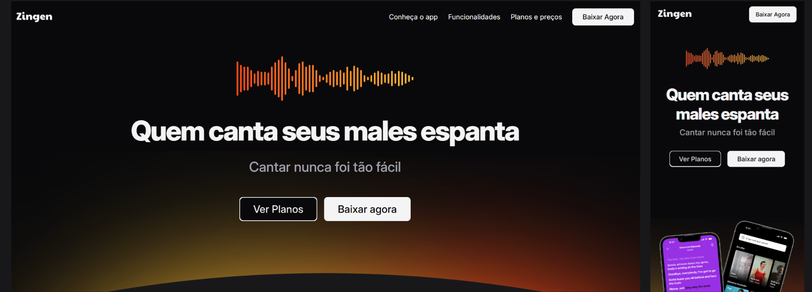

# 🎤 Zingen - Landing Page de Aplicativo  
O **Zingen** é uma aplicação de karaokê inovadora que oferece uma experiência musical interativa e divertida. Este projeto consiste na criação de uma Landing Page responsiva e completa para promover o Zingen, desenvolvido como parte da formação Full-Stack, em um dos conteúdos de especialização.

## 🚀 Tecnologias Utilizadas  
- 🌐 **HTML5**: Estruturação semântica do conteúdo.  
- 🎨 **CSS3**: Estilização e layout responsivo.  
- 📱 **Design Responsivo**: Interface otimizada para dispositivos móveis e desktops.  

## 🌟 Funcionalidades da Landing Page  
- **Apresentação do Aplicativo**: Seções detalhadas destacando as funcionalidades e os diferenciais do Zingen.  
- **Design Moderno**: Layout intuitivo e visualmente atraente que envolve os visitantes.  
- **Interatividade**: Botões de chamada para ação (CTAs) como "Baixar Agora" e "Saiba Mais".  

## 🖼️ Demonstração  
Veja o projeto em tempo real:  
[🎶 Zingen - Landing Page](https://fern-menezes.github.io/zingen/)

## 📂 Estrutura do Projeto  

```  
.  
├── index.html          # Estrutura HTML da Landing Page  
├── style.css           # Estilo CSS da página  
└── assets/             # Imagens, ícones e recursos visuais  
```  

## 🛠️ Como Utilizar  
1. Clone o repositório:  
```bash  
git clone https://github.com/exemplo/zingen 
```  
2. Acesse o diretório do projeto:  

```bash  
cd zingen
```  
3. Abra o arquivo index.html no navegador para visualizar o projeto.  

## 🔧 Melhorias Futuras  
- Adicionar animações e transições para interatividade.  
- Explorar integração com APIs externas para feedback dos usuários.  
- Implementar análise de métricas de visitas.  
- Adicionar suporte a múltiplos idiomas.  

## 📜 Créditos  
Este projeto foi desenvolvido durante a formação Full-Stack da [Rocketseat](https://app.rocketseat.com.br/cart/rocketseat-one-mes-consumidor?referral=fernmenezes&coupon=indicamgm&utm_source=platform&utm_medium=organic&utm_campaign=venda&utm_term=mgm&utm_content=indication-lp_one) ✨.

---

Feito com ❤️ por [Fernanda](https://www.linkedin.com/in/fern-menezes/) ✨
